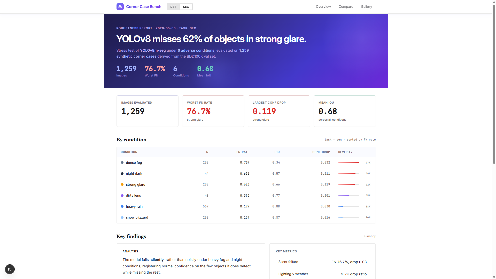
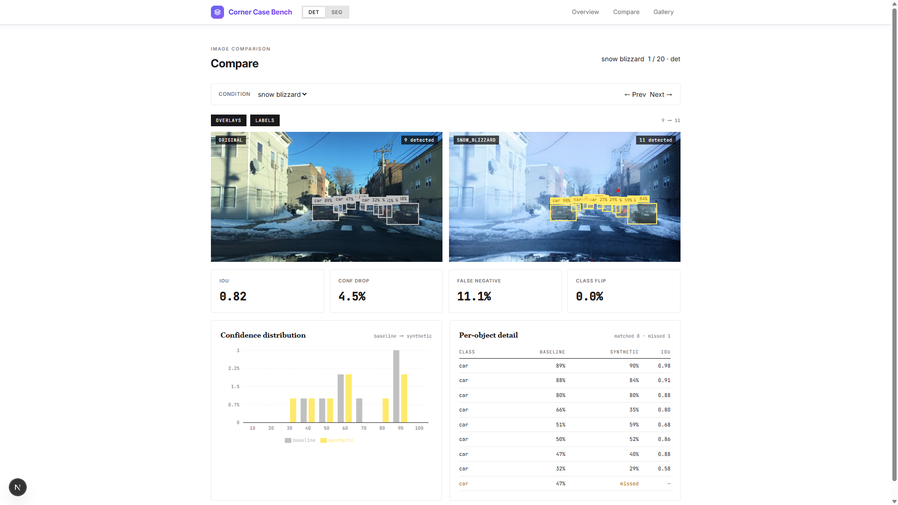
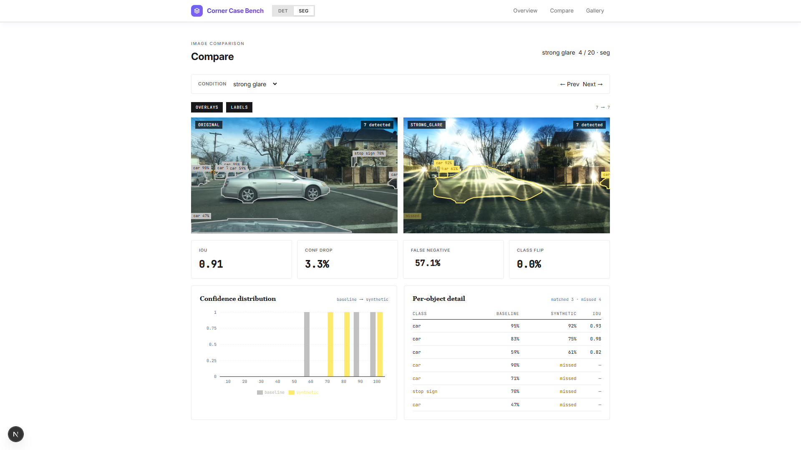
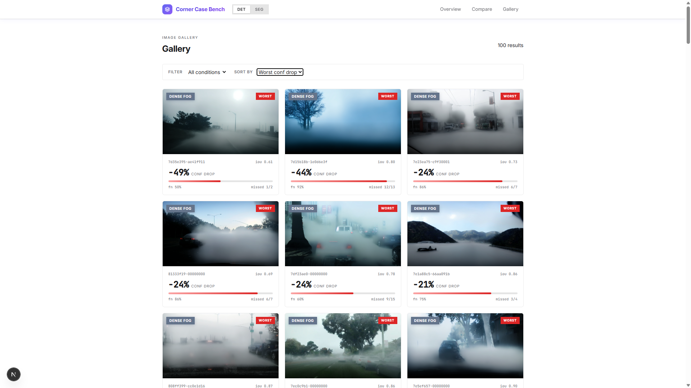

# Corner-Case-Bench

> 악천후 및 조명 코너 케이스에서 객체 검출 / 분할 모델의 강건성을 자동으로 stress-test하는 파이프라인 + 대시보드

InstructPix2Pix로 합성 코너 케이스(짙은 안개, 폭우, 눈, 역광 등)를 생성하고, YOLOv8이 각 조건에서 얼마나 성능이 저하되는지 정량 평가합니다.

---

## Screenshots

**Overview** — 조건별 성능 저하 요약, 클래스 취약성 랭킹



**Compare (Detection)** — Baseline vs Synthetic bbox 비교 + confidence 분포



**Compare (Segmentation)** — Baseline vs Synthetic mask polygon 비교



**Gallery** — 조건/심각도 필터 + worst-case 정렬



---

## Pipeline

```
Original Images (BDD100K)
        │
        ▼
[Stage 1] Baseline Inference ─── YOLOv8m / YOLOv8m-seg
        │
        ▼
[Stage 2] Corner Case Generation ─── InstructPix2Pix
        │
        ▼
[Stage 3] Evaluation ─── re-inference + metrics comparison
        │
        ▼
[Stage 4] Dashboard ─── Next.js + FastAPI
```

---

## Quick Start

### 1. 설치

```bash
pip install -r requirements.txt
cd frontend && npm install
```

### 2. 데이터 준비

BDD100K 이미지를 `data/original/val/`에 배치합니다.

### 3. 파이프라인 실행

```bash
# Detection 전체
python -m pipeline.run_pipeline --stage all

# Segmentation 전체
python -m pipeline.run_pipeline --stage all --task segment

# 단계별
python -m pipeline.run_pipeline --stage baseline
python -m pipeline.run_pipeline --stage generate
python -m pipeline.run_pipeline --stage evaluate
```

| Flag | 설명 | 기본값 |
|------|------|--------|
| `--task` | `detect` / `segment` | `detect` |
| `--stage` | `all` / `baseline` / `generate` / `evaluate` | `all` |
| `--split` | `train` / `val` / `test` / `all` | `val` |
| `--limit` | 처리할 최대 이미지 수 (0 = 전체) | `0` |

### 4. 대시보드

```bash
# Backend
uvicorn backend.main:app --port 8000

# Frontend
cd frontend && npm run dev
```

http://localhost:3000 에서 확인. 상단 **Detection / Segmentation 토글**로 task 전환 가능.

---

## Conditions

| Condition | Category | Severity |
|-----------|----------|----------|
| dense_fog | Weather | Extreme |
| heavy_rain | Weather | Extreme |
| snow_blizzard | Weather | Extreme |
| strong_glare | Lighting | Extreme |
| night_dark | Lighting | Extreme |
| dirty_lens | Occlusion | Moderate |

`configs/prompts.yaml`에서 조건 추가/변경 가능.

---

## Metrics

| Metric | 설명 |
|--------|------|
| **IoU** | Baseline ↔ Synthetic bbox(det) 또는 mask(seg) overlap |
| **Confidence Drop** | 매칭된 객체의 confidence 감소량 |
| **False Negative Rate** | Baseline 객체 중 Synthetic에서 놓친 비율 |
| **Class Flip Rate** | 매칭된 객체 중 클래스가 바뀐 비율 |

Hungarian matching으로 baseline-synthetic 객체를 1:1 매칭합니다.

---

## Results

BDD100K val 1,000장 → **합성 코너 케이스 1,259장** (6 conditions), YOLOv8m / YOLOv8m-seg 평가.

### 조건별 성능 저하

| Condition | n | FN% (seg) | FN% (det) | IoU (seg) | IoU (det) | Conf Drop | 심각도 |
|---|---:|---:|---:|---:|---:|---:|---|
| dense_fog | 200 | **76.7%** | **76.0%** | 0.34 | 0.35 | 0.032 | 치명적 |
| night_dark | 44 | 63.6% | 68.7% | 0.57 | 0.57 | 0.111 | 치명적 |
| strong_glare | 200 | 62.2% | 62.3% | 0.66 | 0.67 | **0.119** | 심각 |
| dirty_lens | 48 | 39.5% | 44.4% | 0.77 | 0.77 | 0.101 | 나쁨 |
| heavy_rain | 567 | 17.9% | 18.1% | 0.88 | 0.88 | 0.030 | 양호 |
| snow_blizzard | 200 | 15.9% | 17.5% | 0.87 | 0.87 | 0.016 | 양호 |

### 가장 취약한 클래스

| Class | Baseline 수 | Miss% | Conf Drop | Class Flip |
|---|---:|---:|---:|---:|
| potted plant | 38 | 78.9% | 0.124 | 0 |
| bench | 18 | 77.8% | -0.097 | 0 |
| stop sign | 102 | 43.1% | 0.028 | 1 |
| traffic light | 1,433 | 42.4% | -0.001 | 0 |
| bus | 214 | 40.2% | 0.025 | 29 |
| person | 803 | 38.9% | 0.043 | 2 |
| car | 8,298 | 36.3% | 0.041 | 75 |
| truck | 777 | 34.1% | 0.036 | **111** |

### Key Insights

1. **Silent failure 지배적** — dense_fog에서 모델이 76.7% 객체를 조용히 놓침 (conf drop은 겨우 0.03)
2. **비균일 조명 >> 균일 날씨** — 역광/야간(FN 40-77%)이 비/눈(FN ~17%)보다 4-7배 치명적
3. **Hallucination 신호** — traffic light, bench는 conf drop 음수 (악조건에서 더 확신있게 detect)
4. **차량 subtype 혼동** — truck 111x, car 75x, bus 29x class flip 발생
5. **Seg ≈ Det** — 모든 condition에서 두 task 간 메트릭 차이 ≤0.02

> 짙은 안개와 야간이 가장 위험. 클래스 단위 robustness는 평균 IoU만으로는 보이지 않음.

---

## Project Structure

```
Corner_Case/
├── pipeline/
│   ├── run_pipeline.py      # CLI 진입점
│   ├── baseline.py          # YOLOv8 baseline inference
│   ├── generator.py         # InstructPix2Pix 코너 케이스 생성
│   └── evaluator.py         # 재추론 + 메트릭 계산
├── backend/
│   └── main.py              # FastAPI REST API
├── frontend/                # Next.js 대시보드
├── configs/
│   └── prompts.yaml         # 조건 프롬프트 및 모델 설정
├── data/
│   ├── original/            # 원본 이미지 (BDD100K)
│   ├── synthetic/           # 생성된 코너 케이스 이미지
│   └── results/
│       ├── baseline_{seg,det}/    # 원본 예측
│       ├── synthetic_{seg,det}/   # Synthetic 예측
│       └── metrics_{seg,det}/     # 이미지별 메트릭
└── tests/
```

---

## Tech Stack

| Layer | Stack |
|-------|-------|
| Generation | InstructPix2Pix (Stable Diffusion) |
| Detection | YOLOv8m / YOLOv8m-seg (Ultralytics) |
| Backend | FastAPI, Uvicorn, OpenCV |
| Frontend | Next.js 16, React 19, Recharts, Tailwind CSS 4, Framer Motion |
